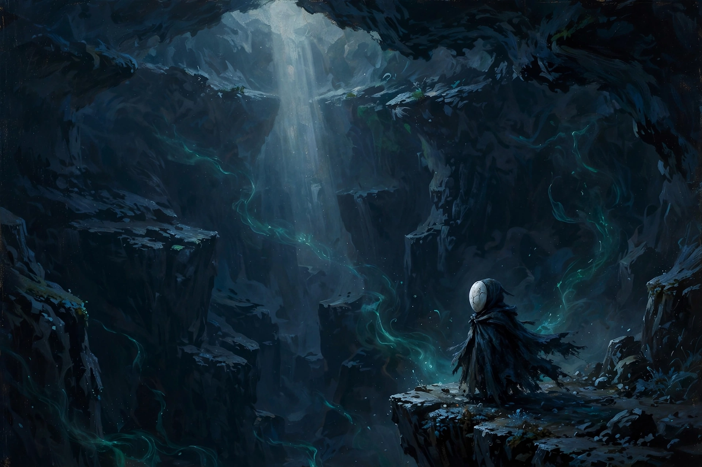
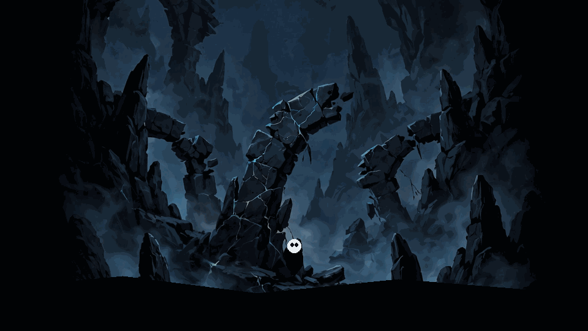

# 🦀 Pale Knight

A Hollow Knight-inspired metroidvania built with **Godot 4.7 (.NET / C#)**.

You are a small pale knight exploring the fallen burrows — a dark, quiet
underworld of caverns, spikes, and restless husks. Slash through crawlers,
dive past flyers, rest at benches, gather soul, and face **The Warden** in
the sealed arena below.

All art is original (procedural silhouettes + generated backgrounds).
All sound is synthesized in-repo.

## Visuals

> **Concept art** — these show the art direction, not gameplay. Real
> screenshots will be captured from a running build and added here.





## Controls

| Action | Key | Gamepad |
|---|---|---|
| Move | A / D or ← / → | Left stick / D-pad |
| Look up / down | W / S or ↑ / ↓ | D-pad up / down |
| Jump | Space | A (bottom button) |
| Dash | Shift | B (right button) |
| Attack (nail slash) | J | X (left button) |
| Cast: tap = Vengeful Spirit, hold = Focus heal | K | Y (top button) |
| Interact (bench) | E | — |
| Pause | Esc | Start |

Down + Attack in midair performs a downward slash — pogo off enemies!

## How to run

Requires **Godot 4.7 .NET edition** (a.k.a. the C# / Mono build).

1. Clone this repo.
2. Open `project.godot` in the Godot 4.7 .NET editor (it will import assets
   on first open).
3. Press **Play** (F5). That's it — no build step needed; the editor
   compiles the C# automatically.

From the command line (if you have the Godot binary + .NET 8 SDK):

```sh
dotnet build PaleKnight.csproj
godot --path . # then press Play in the editor, or run the main scene
```

## Mechanics (tuned to Hollow Knight reference numbers)

- **Health:** 5 masks. Enemy contact = 1 mask; heavy boss hits = 2 masks;
  spikes = 1 mask + return to last safe ground.
- **Soul:** 99 max, +11 per nail hit. Spells and Focus cost 33 each.
  The meter flashes when a cast becomes available.
- **Focus heal:** hold Cast — soul is spent up front and wasted if you're
  interrupted; 1.1 s for the first mask, 0.9 s per chained mask; you're
  rooted and vulnerable while channeling.
- **Vengeful Spirit:** tap Cast with 33+ soul — fires a horizontal spirit
  (3 damage) that passes through enemies.
- **Movement:** snappy accel, 0.35 s dash (0.6 s cooldown, once per airtime),
  0.08 s coyote time + jump buffer, wall slide / wall jump, down-slash pogo.
- **Damage feedback:** ~60 ms hitstop on nail hits, white hit-flash,
  knockback, 1.2 s i-frames, camera shake + dramatic pause on hurt.
- **Death:** your shell breaks and a **Shade** holding all your geo is
  released where you died; your soul meter is capped at 66 until you kill
  it. Die again first and the geo is lost forever.
- **Boss (The Warden):** no HP bar, no damage numbers — ever. ~40 HP,
  hit-count stagger (~8 hits, 2.5 s, max 3 per fight, hitting wakes it),
  roar + phase change below 50% HP, generous heal windows.

## Features (Phase 1)

- Player: run / variable jump / coyote time / jump buffering / dash with
  i-frames + afterimages / wall slide + wall jump / 4-directional nail slash
  with pogo / soul meter / focus-heal / knockback + i-frames / bench respawn
- Enemies: ground crawler (patrols, turns at ledges) and dive-bombing flyer
- Boss: **The Warden** — authentic HK rules (no HP bar; damage shown through
  hit-flash and behavior; hit-count stagger system; enrage phase below 50%;
  telegraphed leap slam / arena dash / arcing projectiles)
- World: 6 hand-designed rooms with room-transition camera slides, spikes,
  benches (heal + respawn + save), parallax backgrounds, fog, dynamic 2D
  lighting, ambient dust
- UI: title screen, HUD (masks / soul vessel / geo), pause menu, death screen
- Save system: JSON to `user://`, stores room/bench/health/geo/boss state
- Audio: fully synthesized SFX + ambient drone + boss music (see `tools/`)

## Roadmap (post-Phase 1)

- Spells: Desolate Dive, Howling Wraiths (+ upgrades)
- Nail Arts (charged slashes), nail upgrades
- Charms + notches (bench-equipped)
- Movement abilities: double jump, wall-cling upgrades
- World map system (quill/compass/pins), stag stations fast travel
- NPCs + dialogue, more bosses, more areas
- Gamepad rumble, accessibility options

## Project layout

```
project.godot          Engine project (Godot 4.7, C#, 1280x720)
PaleKnight.csproj      .NET 8 project (Godot.NET.Sdk/4.7.1)
scenes/Main.tscn       Entry scene (everything else is built in code)
src/                   All C# — player, enemies, boss, world, UI, systems
assets/sfx/            Synthesized WAV sound effects + music loops
assets/textures/       Generated + procedural textures
tools/synth_sfx.py     The synthesizer that made every sound in the game
```
